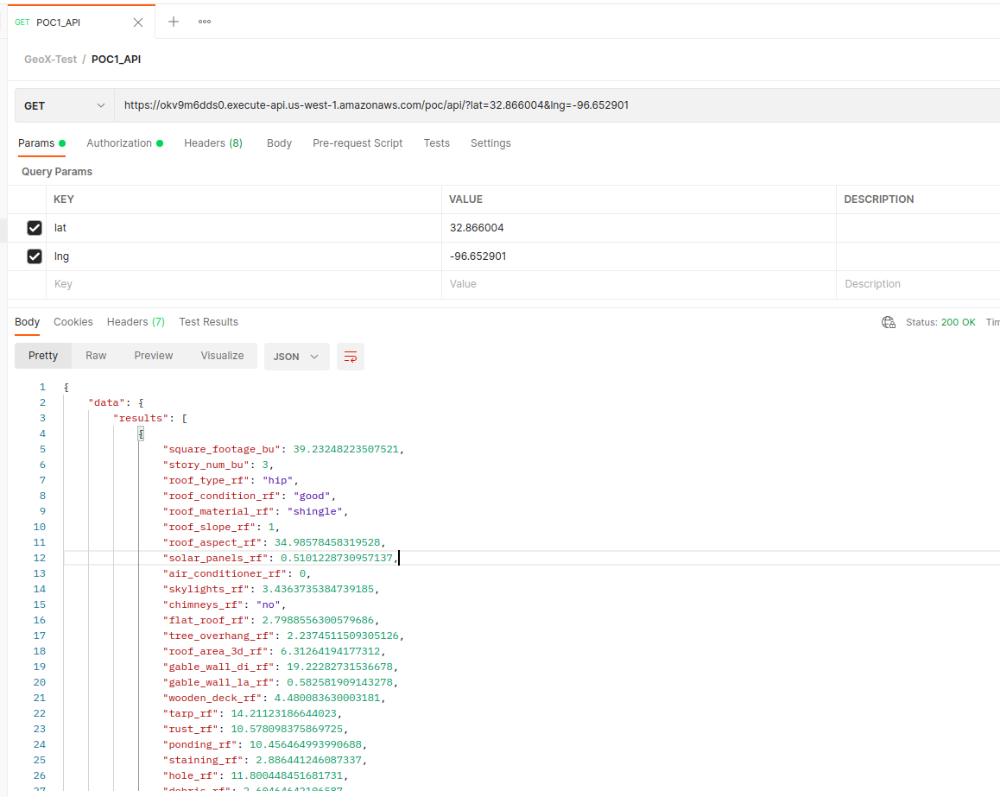

# Overview

This API allows you to search properties from our vast range of footprints data. 

# Guides

The API gets authenticated using AWS IAM. Here are the different ways to hit the API. 

## Hitting API in Postman
1. In Postman, on the Authorization tab, do the following:
- For Type, choose AWS Signature.
- For AccessKey and SecretKey, enter your IAM access key ID and secret access key.

2. In the Enter request URL field, paste your API's invoke URL.
3. Select the appropriate Request Method.
4. Put your lat/lng in the Params section.
5. Finally, hit the API.

### Postman Sample call


### Note 
To manually authenticate your requests using another tool or environment,
use the [Signature Version 4 signing process](https://docs.aws.amazon.com/general/latest/gr/signature-version-4.html).
For more information, see [Signing requests](https://docs.aws.amazon.com/apigateway/api-reference/signing-requests/).

## Hitting API with Python
1. We will need following libraries to be installed
   - requests
   - aws_requests_auth
2. Here is the python code to hit the API
```python
import requests
from aws_requests_auth.aws_auth import AWSRequestsAuth


def m2m_request(access_key, secret_key, lat, lng):
    api_url = "https://okv9m6dds0.execute-api.us-west-1.amazonaws.com/poc/api/"
    aws_details = {
        'aws_access_key': access_key,
        'aws_secret_access_key': secret_key,
        'aws_host': "okv9m6dds0.execute-api.us-west-1.amazonaws.com",
        'aws_region': "us-west-1",
        'aws_service': "execute-api"
    }
    auth = AWSRequestsAuth(**aws_details)
    params = {
        "lat": lat,
        "lng": lng,
    }
    res = requests.get(api_url, auth=auth, params=params)
    assert res.status_code == 200, f"Request failed with status: {res.status_code}"
    res_data = res.json()
    return res_data


if __name__ == '__main__':
    m2m_request("YOUR_API_KEY", "YOUR_API_SECRET", "LATITUDE", "LONGITUDE")
```

## Hitting API with cURL
The API request needs to be signed with AWS Signature Version 4. Please follow this [link](https://docs.aws.amazon.com/general/latest/gr/sigv4-signed-request-examples.html) for more details. 
```shell
curl --location --request GET 'https://okv9m6dds0.execute-api.us-west-1.amazonaws.com/poc/api/?lat=32.866004&lng=-96.652901' \
--header 'X-Amz-Date: 20211124T102508Z' \
--header 'Authorization: AWS4-HMAC-SHA256 Credential=XXXXXXXXXX/20211124/us-west-1/execute-api/aws4_request, SignedHeaders=host;x-amz-date, Signature=XXXXXXXXXXXXXXXXXXXXXXXX' \
--data-raw ''
```

# Request and Response Samples
Here are the sample request and response

## Request Sample
```shell
https://okv9m6dds0.execute-api.us-west-1.amazonaws.com/poc/api/?lat=32.866004&lng=-96.652901
```

## Response Sample
```json
{
    "data": {
        "results": [
            {
                "square_footage_bu": 39.23248223507521,
                "story_num_bu": 3,
                "roof_type_rf": "hip",
                "roof_condition_rf": "good",
                "roof_material_rf": "shingle",
                "roof_slope_rf": 1,
                "roof_aspect_rf": 34.98578458319528,
                "solar_panels_rf": 0.5101228730957137,
                "air_conditioner_rf": 0,
                "skylights_rf": 3.4363735384739185,
                "chimneys_rf": "no",
                "flat_roof_rf": 2.7988556300579686,
                "tree_overhang_rf": 2.2374511509305126,
                "roof_area_3d_rf": 6.31264194177312,
                "gable_wall_di_rf": 19.22282731536678,
                "gable_wall_la_rf": 0.582581909143278,
                "wooden_deck_rf": 4.480083630003181,
                "tarp_rf": 14.21123186644023,
                "rust_rf": 10.578098375869725,
                "ponding_rf": 10.456464993990688,
                "staining_rf": 2.886441246087337,
                "hole_rf": 11.800448451681731,
                "debris_rf": 2.60464642106587,
                "building_height_bu": 29.65666366680722,
                "ground_height_bu": 13.944308413984647,
                "volume_bu": 2.880223555643111,
                "dis_closestbuilding_bu": 12.444873541751065,
                "dis_coast_bu": 8.047036412503925,
                "dis_waterbody_bu": 7.236182645807392,
                "vegetation_immediate_zone_bu": 1.4678871374093903,
                "vegetation_intermediate_zone_bu": 8.751975798108571,
                "vegitation_extended_zone_bu": 5.671901969323377,
                "tree_height_bu": 14.612219840610614,
                "dis_vegetation_bu": 0.008648768255160609,
                "dis_trees_bu": 32.27239252341068,
                "dis_road_bu": 13.799529258973843,
                "ground_slope_bu": 0.2403866508670873,
                "pool_ar_pa": 11.782172004672889,
                "pool_enclosure": "no",
                "temporary_pool_pa": 5.83402300203819,
                "trampoline_pa": "yes",
                "nbr_bld_pa": 1,
                "yard_debris": 31.715137282150454,
                "parking_lots_pa": 26.095067123731937,
                "tanks_pa": 3,
                "sports_fields_pa": 14.89025629175842,
                "fiberglass_pa": 11.263389197434508,
                "carport_pa": 22.263309400544546,
                "woodendeck_pa": 3.2999869087877047,
                "driveway_pa": 35.58572245991153,
                "dis_firestation_wt_pa": 0,
                "dis_firestation_wot_pa": 1,
                "building_stilts_bu": 21.112175244465657,
                "facade_material_bu": "stone",
                "facade_condition_bu": "good",
                "garage_bu": "yes",
                "story_num_ob_bu": 1,
                "roof_material_ob_rf": "concrete",
                "state": "Texas"
            },
            {
                "square_footage_bu": 33.63229103616292,
                "story_num_bu": 4,
                "roof_type_rf": "hip",
                "roof_condition_rf": "good",
                "roof_material_rf": "shingle",
                "roof_slope_rf": 0,
                "roof_aspect_rf": 30.100380783163693,
                "solar_panels_rf": 4.262811161192531,
                "air_conditioner_rf": 1,
                "skylights_rf": 16.92966881147042,
                "chimneys_rf": "no",
                "flat_roof_rf": 5.68266547710805,
                "tree_overhang_rf": 4.461706525493289,
                "roof_area_3d_rf": 19.448815690052836,
                "gable_wall_di_rf": 9.542659246539598,
                "gable_wall_la_rf": 0.36076809929836134,
                "wooden_deck_rf": 14.571208277819022,
                "tarp_rf": 11.708751856953437,
                "rust_rf": 8.26719099274105,
                "ponding_rf": 16.001541749230448,
                "staining_rf": 2.007178868781135,
                "hole_rf": 2.9534150576545306,
                "debris_rf": 2.6423803426154633,
                "building_height_bu": 25.534205196647665,
                "ground_height_bu": 24.999603942067175,
                "volume_bu": 8.517855209303645,
                "dis_closestbuilding_bu": 11.805103535181715,
                "dis_coast_bu": 0.21357815849431538,
                "dis_waterbody_bu": 2.1804659100192323,
                "vegetation_immediate_zone_bu": 11.069761662640705,
                "vegetation_intermediate_zone_bu": 12.807956823520025,
                "vegitation_extended_zone_bu": 3.3087052999292594,
                "tree_height_bu": 10.256986801931074,
                "dis_vegetation_bu": 0.10445071246692189,
                "dis_trees_bu": 24.78916829077007,
                "dis_road_bu": 19.3253256592234,
                "ground_slope_bu": 1.4194255226729593,
                "pool_ar_pa": 11.173839503986338,
                "pool_enclosure": "no",
                "temporary_pool_pa": 5.472810794193726,
                "trampoline_pa": "yes",
                "nbr_bld_pa": 1,
                "yard_debris": 2.2199173020170226,
                "parking_lots_pa": 28.332043490359613,
                "tanks_pa": 4,
                "sports_fields_pa": 19.319242796324218,
                "fiberglass_pa": 0.9281673916324964,
                "carport_pa": 0.8078266258764544,
                "woodendeck_pa": 3.0690475599961546,
                "driveway_pa": 7.580352758374231,
                "dis_firestation_wt_pa": 0,
                "dis_firestation_wot_pa": 16,
                "building_stilts_bu": 26.07857575873261,
                "facade_material_bu": "stone",
                "facade_condition_bu": "good",
                "garage_bu": "yes",
                "story_num_ob_bu": 3,
                "roof_material_ob_rf": "concrete",
                "state": "Texas"
            }
        ]
    },
    "msg": "OK",
    "status": 200
}
```

# API Reference
Please visit this [link](https://db8sxr6e96.execute-api.us-west-1.amazonaws.com/api/docs) for API reference
